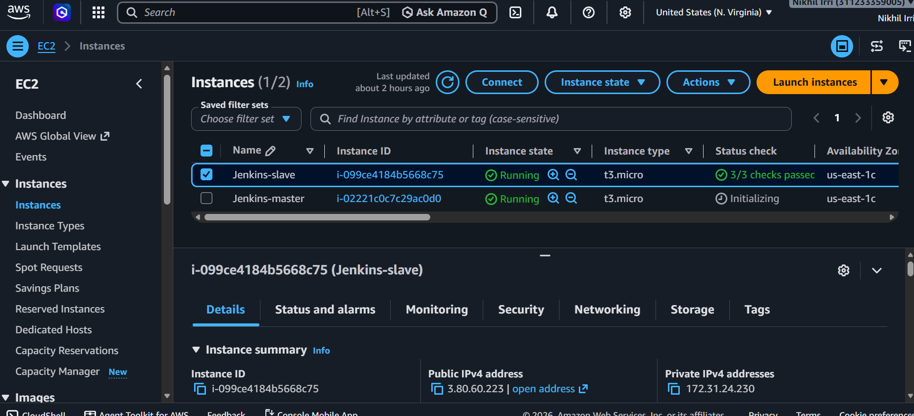
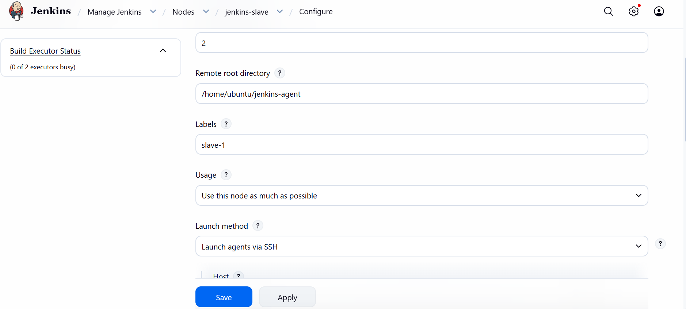
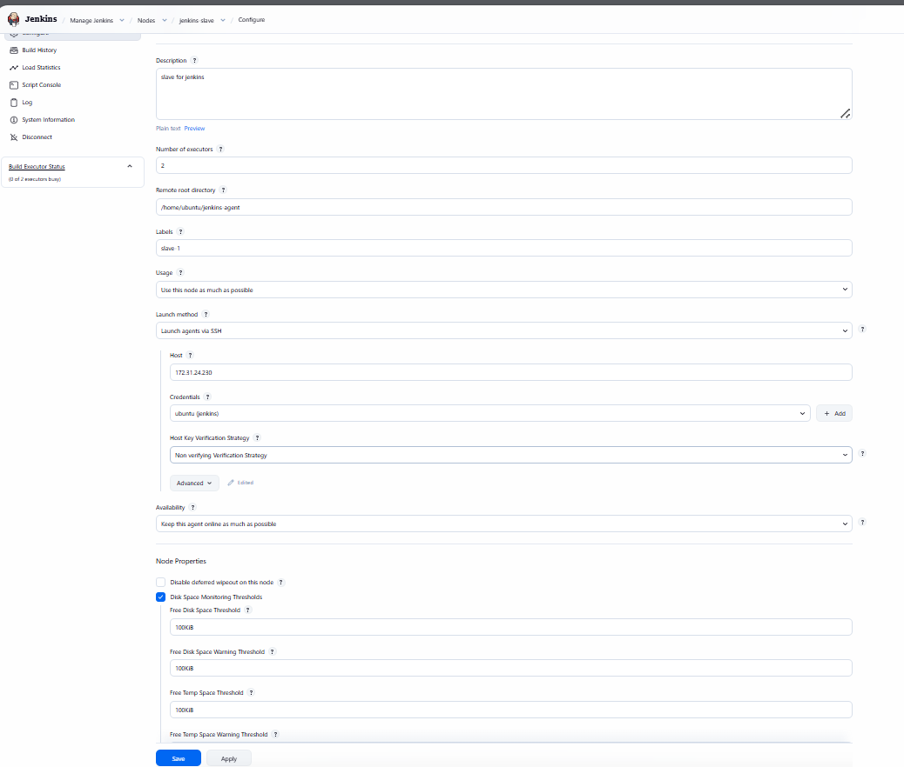
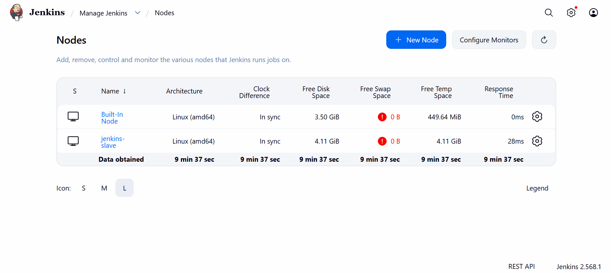
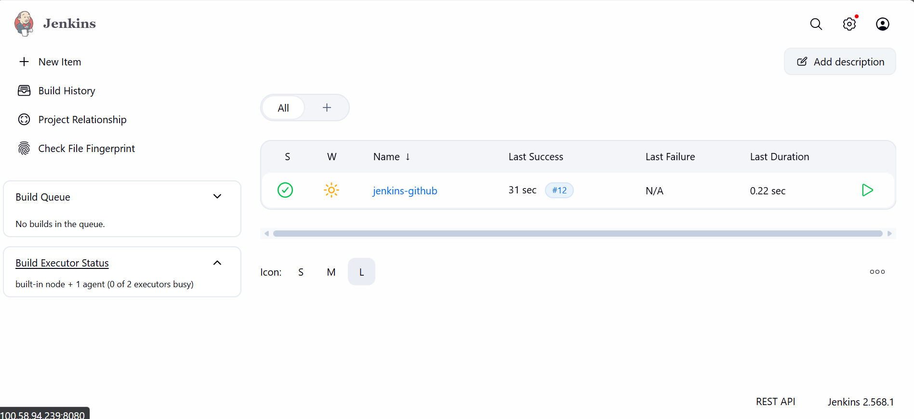
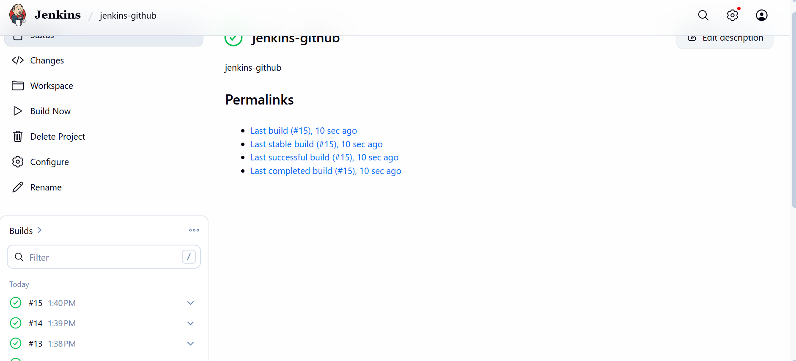

# Jenkins Master-Agent Setup on AWS EC2 🚀

A hands-on practice project setting up a **Jenkins Master-Agent (Slave) architecture** using two AWS EC2 instances, connected to a GitHub repository, with builds running on the agent node.

## 📌 What This Project Does

- Two AWS EC2 (Ubuntu) instances were launched: one as the **Jenkins Master**, one as the **Jenkins Agent (Slave)**.
- Jenkins was installed on the Master.
- The Agent was connected to the Master via SSH as a **Permanent Agent node**.
- A Jenkins job (`jenkins-github`) was created, connected to a GitHub repository.
- Builds were triggered and verified as running successfully.

## 🛠️ Tech Used

- AWS EC2 (Ubuntu)
- Jenkins
- SSH (Master → Agent connection)
- GitHub

## 🔧 Steps I Followed

### 1. Launched two EC2 instances
- `Jenkins-master` and `Jenkins-slave`, both Ubuntu, `t3.micro`
- Same key pair used for both instances
- Security group allowed SSH (22) and Jenkins port (8080)

### 2. Installed Jenkins on the Master instance
- Installed Java (OpenJDK)
- Added the Jenkins APT repository and signing key
- Installed Jenkins and started the service
- Unlocked Jenkins using the initial admin password and installed suggested plugins

### 3. Installed Java and Git on the Agent (Slave) instance
- The agent only needed Java (to run the Jenkins agent process) and Git (to check out code)

### 4. Connected the Agent to the Master
- Generated SSH credentials in Jenkins using the `ubuntu` username and the EC2 key pair
- Went to **Manage Jenkins → Nodes → New Node**, created a Permanent Agent named `jenkins-slave`
- Configured:
  - **Remote root directory:** `/home/ubuntu/jenkins-agent`
  - **Labels:** `slave-1`
  - **Usage:** Use this node as much as possible
  - **Launch method:** Launch agents via SSH
  - **Host:** Agent's private IP (`172.31.24.230`)
  - **Credentials:** `ubuntu` (SSH private key)
  - **Host Key Verification Strategy:** Non verifying Verification Strategy

### 5. Verified the Agent connected successfully
- Checked **Manage Jenkins → Nodes** — both **Built-In Node** and **jenkins-slave** showed as connected (In sync)

### 6. Created a Jenkins job connected to GitHub
- Job name: `jenkins-github`
- Connected to the GitHub repository under Source Code Management
- Ran builds and confirmed successful completion

### 7. Ran multiple builds and verified success
- Builds #13, #14, #15 all completed successfully
- Confirmed via Build History and Console Output

## ✅ What I Practiced

- Setting up Jenkins Master and Agent on separate EC2 instances
- Connecting an Agent node to Master via SSH
- Troubleshooting real SSH/authentication issues (correct username for Ubuntu, correct private key format)
- Connecting a Jenkins job to GitHub
- Running and verifying builds on the agent node

## 📂 Repository Contents

| File/Folder | Description |
|---|---|
| `index.html` | Sample webpage used as the build source |
| `style.css` | Styling for the sample webpage |
| `screenshots/` | Screenshots of the Jenkins setup |
| `README.md` | This file |

---
*Personal practice project to learn Jenkins Master-Agent setup using AWS EC2.*
